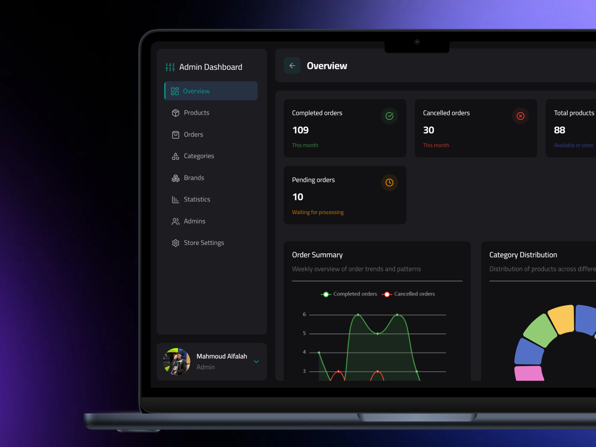
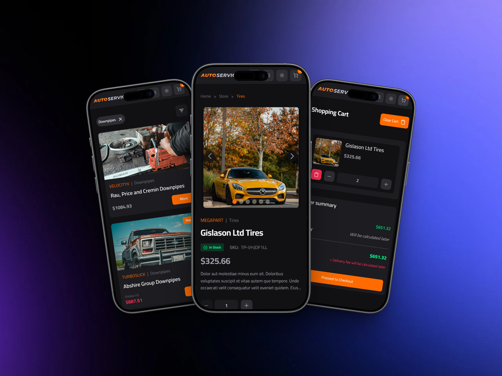
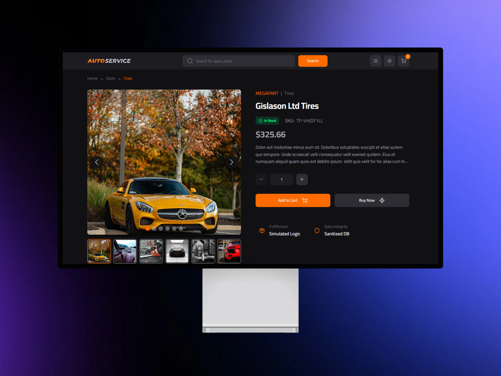

# 🚀 E-commerce Architecture Showcase (White-Labeled)

This repository contains a **sanitized, white-labeled version** of a production-grade auto-parts e-commerce platform built with **React** and **Laravel**. 

Due to client NDAs and proprietary branding, the original repository is private. This curated selection serves as a showcase of core systems architecture, engineering decisions, and clean code standards.

### **Core Architectural Focus**
* **Frontend:** Implemented using **Feature-Sliced Design (FSD)** for high-level modularity and separation of concerns.
* **Backend:** Developed with a strict adherence to **SOLID principles** (specifically SRP and OCP) to ensure a maintainable and scalable API.

---

### **Visual Preview**

#### **Admin Intelligence & Analytics**

#### **Responsive UX Flow**

#### **Desktop Experience**

---

### **Live Demo**
*   **Storefront:** [autoparts.malfalah.com](https://autoparts.malfalah.com)
*   **Admin Panel:** [autoparts.malfalah.com/admin](https://autoparts.malfalah.com/admin)

**Demo Credentials (Read-Only Middleware Active):**
*   **User:** `demo@malfalah.com`
*   **Pass:** `logindemo`